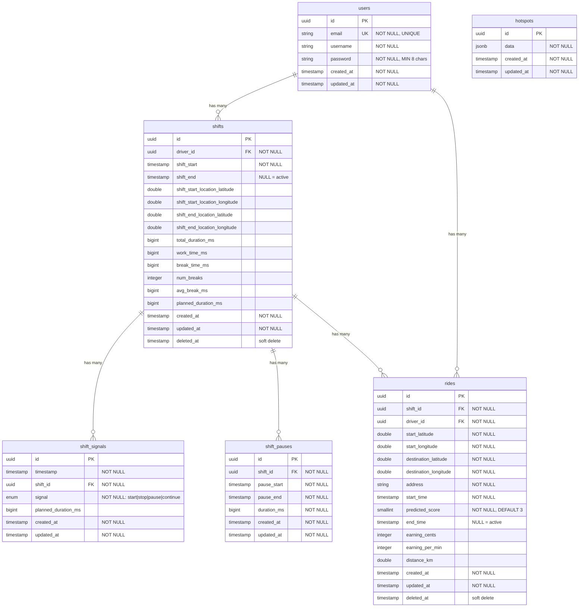

# Database Schema Documentation

## Entity Relationship Diagram



## Database Constraints

### Primary Keys
- All tables use UUID as primary key with auto-generation (`DataTypes.UUIDV4`)

### Foreign Key Constraints
| Table | Column | References | Constraint |
|-------|--------|------------|------------|
| shifts | driver_id | users.id | NOT NULL |
| shift_signals | shift_id | shifts.id | NOT NULL |
| shift_pauses | shift_id | shifts.id | NOT NULL |
| rides | shift_id | shifts.id | NOT NULL |
| rides | driver_id | users.id | NOT NULL |

### Unique Constraints
| Table | Constraint Name | Fields | Condition | Description |
|-------|----------------|--------|-----------|-------------|
| users | email_unique | email | - | Each email must be unique |
| shifts | one_active_shift_per_driver | driver_id | WHERE shift_end IS NULL | Only one active shift per driver |
| rides | one_active_ride_per_shift | shift_id | WHERE end_time IS NULL | Only one active ride per shift |

### Check Constraints
| Table | Column | Constraint | Description |
|-------|--------|------------|-------------|
| users | email | Valid email format | Must match email regex pattern |
| users | password | Length 8-100 | Password must be between 8 and 100 characters |
| shift_signals | signal | ENUM check | Must be one of: 'start', 'stop', 'pause', 'continue' |

### Default Values
| Table | Column | Default | Description |
|-------|--------|---------|-------------|
| all tables | id | UUIDV4 | Auto-generated UUID |
| rides | predicted_score | 3 | Default prediction score |
| all tables | created_at | CURRENT_TIMESTAMP | Set on insert |
| all tables | updated_at | CURRENT_TIMESTAMP | Updated on modification |

### Indexes
| Table | Index Name | Columns | Type | Purpose |
|-------|------------|---------|------|---------|
| shifts | idx_shifts_driver_id | driver_id | BTREE | Foreign key lookups |
| shifts | idx_shifts_shift_start | shift_start | BTREE | Temporal queries |
| shifts | idx_shifts_deleted_at | deleted_at | BTREE | Soft delete filtering |
| shift_signals | idx_shift_signals_shift_id | shift_id | BTREE | Foreign key lookups |
| shift_signals | idx_shift_signals_timestamp | timestamp | BTREE | Temporal queries |
| shift_pauses | idx_shift_pauses_shift_id | shift_id | BTREE | Foreign key lookups |
| rides | idx_rides_shift_id | shift_id | BTREE | Foreign key lookups |
| rides | idx_rides_driver_id | driver_id | BTREE | Driver queries |
| rides | idx_rides_start_time | start_time | BTREE | Temporal queries |
| rides | idx_rides_deleted_at | deleted_at | BTREE | Soft delete filtering |

## Special Features

### Soft Deletes (Paranoid)
- **Tables**: `shifts`, `rides`
- **Implementation**: `deleted_at` timestamp column
- **Behavior**: Records are not physically deleted, just marked with deletion timestamp

### Automatic Timestamps
- All tables have `created_at` and `updated_at` columns
- `updated_at` is automatically updated on record modification
- Sequelize options: `timestamps: true, underscored: true`

### Password Security
- **Table**: `users`
- **Implementation**: Bcrypt hashing in `beforeSave` hook
- **Salt rounds**: 10

### JSONB Storage
- **Table**: `hotspots`
- **Column**: `data`
- **Purpose**: Flexible schema-less storage for hotspot information

## Sequelize Model Configuration

### Common Options
```javascript
{
    sequelize,
    tableName: 'table_name',
    timestamps: true,
    underscored: true  // createdAt → created_at
}
```

### Model-Specific Options
- **shifts, rides**: `paranoid: true` (soft deletes)
- **users**: Custom `beforeSave` hook for password hashing
- **All models**: UUID primary keys with auto-generation

## Business Logic Constraints

1. **One Active Shift per Driver**
   - A driver cannot have multiple shifts running simultaneously
   - Enforced by unique index on `driver_id` where `shift_end IS NULL`

2. **One Active Ride per Shift**
   - A shift cannot have multiple rides active at the same time
   - Enforced by unique index on `shift_id` where `end_time IS NULL`

3. **Shift Signal Sequence**
   - Signals must follow logical order: start → pause/continue → stop
   - Enforced at application level

4. **Password Requirements**
   - Minimum 8 characters, maximum 100 characters
   - Automatically hashed before storage

5. **Email Validation**
   - Must be valid email format
   - Must be unique across all users