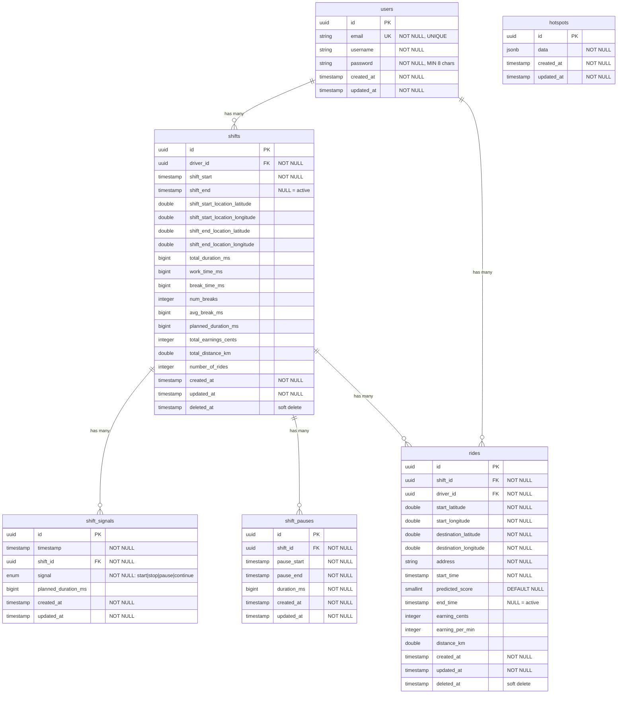

# Database Schema

This application uses PostgreSQL as its database management system, leveraging its robust features for data integrity, performance, and advanced data types like JSONB for optimal driver management and ride tracking.

> 🔗 **See [Entity Interactions & System Architecture](../src/entities/README.md)** for visual diagrams showing how these entities interact with each other through signals, validations, and database operations.

## 📊 Entity Relationship Diagram

## 🔒 Database Constraints

Our database schema implements comprehensive constraints to ensure data integrity and business rule enforcement.

### 🔑 **Primary Keys**
- **Strategy**: All tables use UUID as primary key with auto-generation (`DataTypes.UUIDV4`)
- **Benefits**: Distributed system compatibility and enhanced security through unpredictable IDs

### 🔗 **Foreign Key Constraints**
| Table | Column | References | Constraint |
|-------|--------|------------|------------|
| shifts | driver_id | users.id | NOT NULL |
| shift_signals | shift_id | shifts.id | NOT NULL |
| shift_pauses | shift_id | shifts.id | NOT NULL |
| rides | shift_id | shifts.id | NOT NULL |
| rides | driver_id | users.id | NOT NULL |

### ⭐ **Unique Constraints**
| Table | Constraint Name | Fields | Condition | Description |
|-------|----------------|--------|-----------|-------------|
| users | email_unique | email | - | Each email must be unique |
| shifts | one_active_shift_per_driver | driver_id | WHERE shift_end IS NULL | Only one active shift per driver |
| rides | one_active_ride_per_shift | shift_id | WHERE end_time IS NULL | Only one active ride per shift |

### ✅ **Check Constraints**
| Table | Column | Constraint | Description |
|-------|--------|------------|-------------|
| users | email | Valid email format | Must match email regex pattern |
| users | password | Length 8-100 | Password must be between 8 and 100 characters |
| shift_signals | signal | ENUM check | Must be one of: 'start', 'stop', 'pause', 'continue' |

### 📝 **Default Values**
| Table | Column | Default | Description |
|-------|--------|---------|-------------|
| all tables | id | UUIDV4 | Auto-generated UUID |
| rides | predicted_score | NULL | Default prediction score |
| all tables | created_at | CURRENT_TIMESTAMP | Set on insert |
| all tables | updated_at | CURRENT_TIMESTAMP | Updated on modification |

### 🚀 **Indexes** 
| Table | Index Name | Columns | Type | Purpose |
|-------|------------|---------|------|---------|
| shifts | one_active_shift_per_driver | driver_id | UNIQUE (WHERE shift_end IS NULL) | Ensures only one active shift per driver |
| rides | one_active_ride_per_shift | shift_id | UNIQUE (WHERE end_time IS NULL) | Ensures only one active ride per shift |

## ⚡ Special Features

Advanced database features that enhance data safety and performance.

### 🗂️ **Soft Deletes (Paranoid)**
- **Affected Tables**: `shifts`, `rides`
- **Implementation**: `deleted_at` timestamp column with automatic handling
- **Behavior**: Records are not physically deleted, just marked with deletion timestamp
- **Benefits**: Data recovery capability and audit trail preservation

## 🎯 Business Logic Constraints

Critical business rules enforced through database constraints and application logic to maintain system integrity.

### 🚫 **State Management Rules**

1. **👤 One Active Shift per Driver**
   - **Rule**: A driver cannot have multiple shifts running simultaneously
   - **Enforcement**: Unique index on `driver_id` where `shift_end IS NULL`
   - **Purpose**: Prevents conflicting shift data and ensures accurate time tracking

2. **🚗 One Active Ride per Shift**
   - **Rule**: A shift cannot have multiple rides active at the same time
   - **Enforcement**: Unique index on `shift_id` where `end_time IS NULL`
   - **Purpose**: Maintains clean ride-to-shift relationships and accurate earnings calculation

### 🔄 **Sequential Logic Rules**

3. **📡 Shift Signal Sequence**
   - **Rule**: Signals must follow logical order: `start` → `pause`/`continue` → `stop`
   - **Enforcement**: Application-level validation in signal service
   - **Purpose**: Ensures valid state transitions and prevents invalid shift states

### 🔐 **Security & Data Validation**

4. **🔒 Password Requirements**
   - **Rule**: Minimum 8 characters, maximum 100 characters
   - **Enforcement**: Database constraint and pre-save validation
   - **Security**: Automatically hashed with bcrypt before storage

5. **📧 Email Validation**
   - **Rule**: Must be valid email format and unique across all users
   - **Enforcement**: Database unique constraint and format validation
   - **Purpose**: Ensures reliable user identification and communication