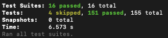

# Testing Strategy

## Test-Driven Development (TDD) Approach

This project follows a Test-Driven Development methodology with an enhanced four-phase approach:

### 1. Planning Phase (Enhancement to Traditional TDD)
Before writing any code or tests, we document the expected behavior in plain English. This involves:
- Clearly defining the feature requirements
- Outlining expected inputs and outputs
- Creating a mental model of the implementation

### 2. Red Phase
Write a failing test that defines the desired functionality:
- Start with the simplest test case
- Focus on testing behavior, not implementation details

### 3. Green Phase
Write the minimum code necessary to make the test pass:
- Implement only what's needed to satisfy the test
- Keep the implementation simple and straightforward

### 4. Refactor Phase
Improve the code while keeping tests green:
- Remove duplication
- Ensure all tests continue to pass

## Test Results



### Current Test Coverage Summary

```
Test Suites: 16 passed, 16 total
Tests:       4 skipped, 151 passed, 155 total
Snapshots:   0 total
Time:        6.573 s
```

## Test Organization

The project maintains a clear separation between different types of tests:

### Unit Tests
- Located in `tests/unit/` directories within each entity
- Focus on testing individual components in isolation
- Mock external dependencies
- Examples: `hotspotsController.unit.test.ts`, `shiftService.unit.test.ts`

### Integration Tests
- Located in `tests/integration/` directories within each entity
- Test the interaction between multiple components
- Use real database connections and API endpoints
- Examples: `rideAPI.integration.test.ts`, `statsAPI.integration.test.ts`

## Running Tests

```bash
# Run all tests
npm test

# Run tests in watch mode
npm run test:watch

# Run tests with coverage
npm run test:coverage

# Run specific test file
npm test -- path/to/test.ts
```
