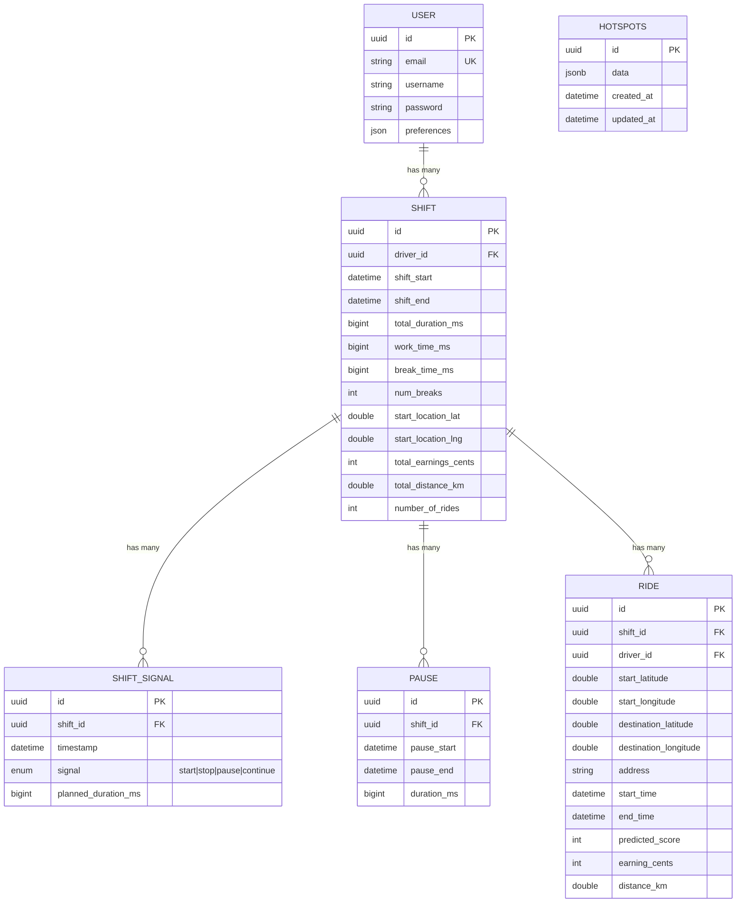

# Entities

This directory contains the core business entities and their associated logic for the backend application. Each entity is organized as a self-contained module with its own controllers, services, models, routes, and tests.

## Directory Structure

- **auth/** - Authentication and authorization logic
- **hotspots/** - Hotspot management for ride demand areas
- **rides/** - Ride lifecycle management and ML-powered features
- **shift-pauses/** - Break time tracking during shifts
- **shift-signals/** - Real-time shift event signaling
- **shifts/** - Work shift management and calculations
- **stats/** - Statistical analysis and reporting
- **users/** - User profile and account management

## Architecture Pattern

Each entity module follows a consistent architecture:
- `*.model.ts` - Database schemas and data models
- `*.controller.ts` - HTTP request handlers
- `*.service.ts` - Business logic layer
- `*.routes.ts` - API endpoint definitions
- `*.repository.ts` - Data access layer (where applicable)
- `tests/` - Unit and integration tests
- `utils/` - Entity-specific utilities

## Entity Relationships and Interactions

The backend follows a hierarchical data model where entities are interconnected through well-defined relationships:

### Entity Relationship Diagram

### Key Entity Interactions

#### 1. **User → Shift → Ride Flow**
- A **User** (driver) can start multiple **Shifts** but only one active shift at a time
- Each **Shift** can contain multiple **Rides**, but only one active ride at a time
- The system enforces these constraints through unique indexes in the database

#### 2. **Shift State Management**
- **Shift Signals** track state transitions (start, stop, pause, continue) with timestamps
- **Pauses** are derived from shift signals and store calculated break periods
- The shift service aggregates signals and pauses to calculate work time, break time, and other metrics

#### 3. **Ride Lifecycle**
- Rides can only be started during an active, non-paused shift
- Each ride includes ML-predicted scores for route optimization
- Ride earnings and distance are calculated upon completion and aggregated into shift totals

#### 4. **Data Aggregation**
- **Stats Service** queries across shifts, rides, and pauses to generate driver analytics
- Shift totals are calculated when a shift ends, aggregating all rides and pause data
- The system maintains data integrity through transactional operations

#### 5. **ML Integration**
- **Hotspots** entity caches ML predictions for high-demand areas
- **Rides** receive predictive scores before starting to help drivers make informed decisions
- The ML service integrates with external APIs but includes fallback mechanisms

### Business Rules Enforcement

1. **One Active Shift Rule**: Enforced by unique index on `shifts` table where `shift_end IS NULL`
2. **One Active Ride Rule**: Enforced by unique index on `rides` table where `end_time IS NULL`
3. **No Rides During Pause**: Validated in ride service by checking last shift signal
4. **Shift Ownership**: All operations verify `driver_id` matches authenticated user
5. **Data Retention**: Soft deletes (paranoid mode) on shifts and rides preserve historical data

### Service Layer Interactions

Services communicate through direct method calls following these patterns:

- **ShiftService** → **PauseService**: For break calculations
- **ShiftService** → **RideService**: For ride aggregations
- **RideService** → **ShiftRepository**: To verify active shift status
- **StatsService** → **ShiftRepository** & **RideRepository**: For analytics
- **AuthController** → **User Model**: For authentication

## Testing

All entities include comprehensive test coverage with both unit tests for individual components and integration tests for API endpoints and workflows.