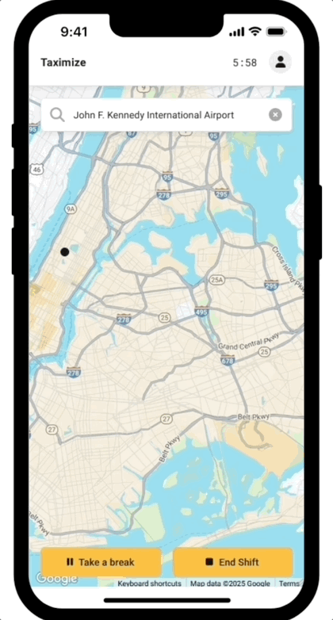

# Shift Pauses

The Shift Pauses entity manages pause tracking during driver shifts. It records when drivers take breaks, calculates pause durations, and provides pause information for shift reporting

## 📖 API Documentation
**[View Complete API Reference →](../../../documentation/API_Documentation/shifts.md)** *(Pauses are managed through shift signals)*

## 🏗️ Architecture

The entity follows a simple two-component structure:

- **`pause.model.ts`** - Sequelize model representing pause records in the database
- **`pause.service.ts`** - Business logic for creating and retrieving pause information

Note: This entity doesn't have its own controller or routes because pause operations are handled indirectly through the shift signals system. Pauses are created automatically when processing continue signals, rather than through direct API calls

## 💡 Design Rationale

The pause tracking system is intentionally simple - it relies on the existing shift signals infrastructure rather than implementing a separate pause tracking mechanism. This ensures consistency and reduces complexity while providing accurate break time tracking for compliance and reporting purposes.

### 🔗 Integration with other entities

- **Shift Signals** - Reads pause/continue signals to detect break periods
- **Shifts** - Links pauses to their parent shift for reporting