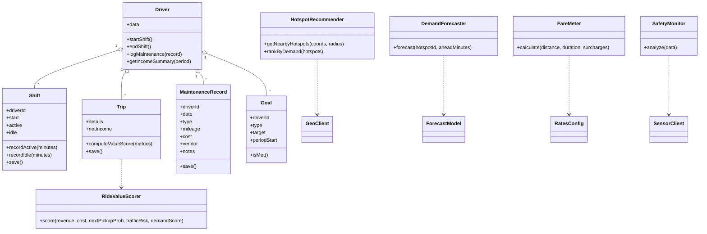

```mermaid
classDiagram
    %%—— Domain Classes ——%%
    class Driver {
      +data
      +startShift()
      +endShift()
      +logMaintenance(record)
      +getIncomeSummary(period)
    }
    class Shift {
      +driverId
      +start
      +active
      +idle
      +recordActive(minutes)
      +recordIdle(minutes)
      +save()
    }
    class Trip {
      +details
      +netIncome
      +computeValueScore(metrics)
      +save()
    }
    class MaintenanceRecord {
      +driverId
      +date
      +type
      +mileage
      +cost
      +vendor
      +notes
      +save()
    }
    class Goal {
      +driverId
      +type
      +target
      +periodStart
      +isMet()
    }
    class RideValueScorer {
      +score(revenue, cost, nextPickupProb, trafficRisk, demandScore)
    }
    class HotspotRecommender {
      +getNearbyHotspots(coords, radius)
      +rankByDemand(hotspots)
    }
    class DemandForecaster {
      +forecast(hotspotId, aheadMinutes)
    }
    class FareMeter {
      +calculate(distance, duration, surcharges)
    }
    class SafetyMonitor {
      +analyze(data)
    }

    %%—— External Dependencies ——%%
    class GeoClient
    class ForecastModel
    class RatesConfig
    class SensorClient

    %%—— Relationships ——%%
    Driver "1" o-- "*" Shift
    Driver "1" o-- "*" Trip
    Driver "1" o-- "*" MaintenanceRecord
    Driver "1" o-- "*" Goal

    Trip ..> RideValueScorer
    HotspotRecommender ..> GeoClient
    DemandForecaster ..> ForecastModel
    FareMeter ..> RatesConfig
    SafetyMonitor ..> SensorClient

```