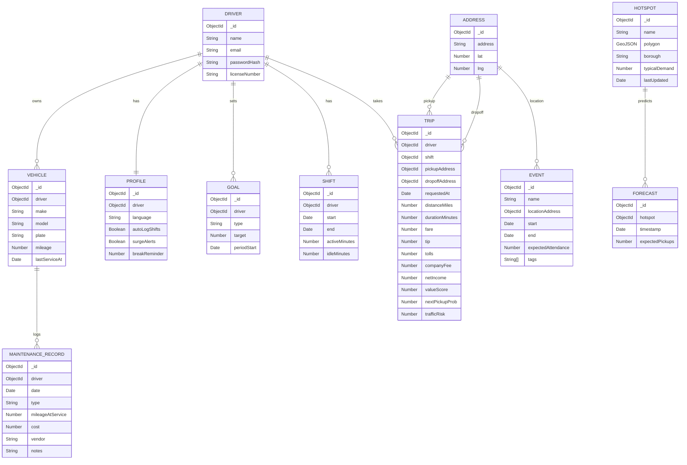

```mermaid
erDiagram
    DRIVER ||--o{ VEHICLE               : owns
    DRIVER ||--|| PROFILE               : has
    DRIVER ||--o{ GOAL                  : sets
    DRIVER ||--o{ SHIFT                 : has
    DRIVER ||--o{ TRIP                  : takes
    VEHICLE ||--o{ MAINTENANCE_RECORD    : logs

    HOTSPOT ||--o{ FORECAST             : predicts

    ADDRESS ||--o{ TRIP                  : pickup
    ADDRESS ||--o{ TRIP                  : dropoff
    ADDRESS ||--o{ EVENT                 : location

    DRIVER {
      ObjectId _id
      String    name
      String    email
      String    passwordHash
      String    licenseNumber
    }
    VEHICLE {
      ObjectId _id
      ObjectId driver
      String    make
      String    model
      String    plate
      Number    mileage
      Date      lastServiceAt
    }
    PROFILE {
      ObjectId _id
      ObjectId driver
      String    language
      Boolean   autoLogShifts
      Boolean   surgeAlerts
      Number    breakReminder
    }
    SHIFT {
      ObjectId _id
      ObjectId driver
      Date      start
      Date      end
      Number    activeMinutes
      Number    idleMinutes
    }
    TRIP {
      ObjectId _id
      ObjectId driver
      ObjectId shift
      ObjectId pickupAddress
      ObjectId dropoffAddress
      Date      requestedAt
      Number    distanceMiles
      Number    durationMinutes
      Number    fare
      Number    tip
      Number    tolls
      Number    companyFee
      Number    netIncome
      Number    valueScore
      Number    nextPickupProb
      Number    trafficRisk
    }
    MAINTENANCE_RECORD {
      ObjectId _id
      ObjectId driver
      Date      date
      String    type
      Number    mileageAtService
      Number    cost
      String    vendor
      String    notes
    }
    GOAL {
      ObjectId _id
      ObjectId driver
      String    type
      Number    target
      Date      periodStart
    }
    HOTSPOT {
      ObjectId _id
      String    name
      GeoJSON   polygon
      String    borough
      Number    typicalDemand
      Date      lastUpdated
    }
    FORECAST {
      ObjectId _id
      ObjectId hotspot
      Date      timestamp
      Number    expectedPickups
    }
    EVENT {
      ObjectId _id
      String    name
      ObjectId  locationAddress
      Date      start
      Date      end
      Number    expectedAttendance
      String[]  tags
    }
    ADDRESS {
      ObjectId _id
      String    address
      Number    lat
      Number    lng
    }

```