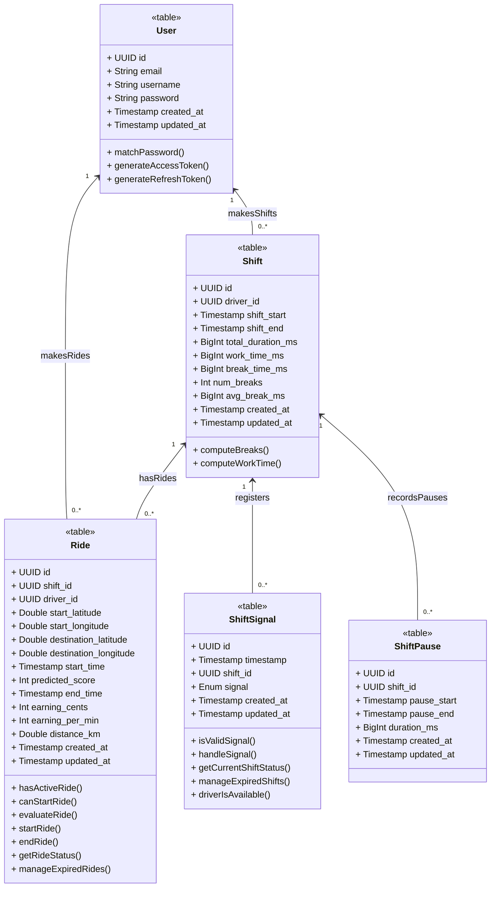

> Last Update of this folder: 20/12/24
> 
> **⚠️ CRITICAL ISSUE FOUND AND PARTIALLY FIXED**
> A comprehensive analysis of API misalignments between Frontend and Backend has been completed.
> See [API_Misalignment_Analysis.md](../API_Misalignment_Analysis.md) for full details.
>
> **Key Issues:**
> - ✅ **FIXED**: Frontend axios baseURL configuration preventing access to shifts/rides APIs
> - ❌ **MISSING**: User management APIs (documented in [UserManagement.md](UserManagement.md))
> - ⚠️ **GAPS**: Frontend uses local state instead of documented backend APIs for shifts/rides

### Current Class Diagram

> 

